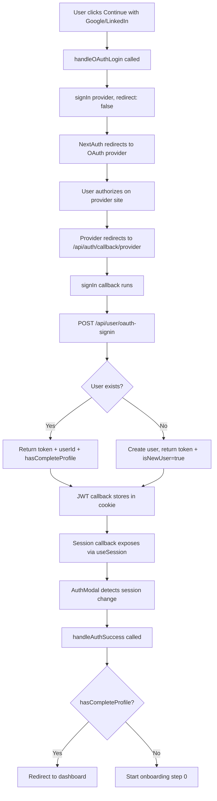

# 🔐 Authentication & Onboarding Flow Documentation

> Complete guide to understanding user authentication and onboarding flow using NextAuth.js

---

## 📋 Table of Contents

1. [Initial Page Load](#1-initial-page-load)
2. [Authentication Flow](#2-authentication-flow)
3. [JWT Token Management](#3-jwt-token-management)
4. [Onboarding Step Flow](#4-onboarding-step-flow)
5. [Profile Completion](#5-profile-completion)
6. [Post-Onboarding](#6-post-onboarding)
7. [Key State Flags](#7-key-state-flags)
8. [Complete Data Flow Diagram](#8-complete-data-flow-diagram)
9. [Token Expiration Scenarios](#9-token-expiration-scenarios)
10. [Critical Implementation Notes](#10-critical-implementation-notes)
11. [Summary Table](#11-summary-table)

---

## 1. Initial Page Load

### 🎯 Entry Point: `/onboarding/signup`

**Component:** `OnboardingFlow`  
**Hook:** `useOnboardingFlow`

#### Initial Sequence

```javascript
1. Component mounts → useOnboardingFlow initializes
2. Sets isInitializing = true
3. Sets loadingMessage = "Setting up..."
4. useSession() checks authentication status
```

#### Status Check Logic

| Status | Action |
|--------|--------|
| `status === "loading"` | 🔄 Show loading screen, wait |
| `status === "unauthenticated"` | 🚪 Show AuthModal (no user logged in) |
| `status === "authenticated"` | ✅ Check `session.hasCompleteProfile` |

**When Authenticated:**
- ✅ `hasCompleteProfile === true` → Redirect to `/dashboard`
- ⏳ `hasCompleteProfile === false` → Start onboarding at step 0

---

## 2. Authentication Flow

### A. No Session - Show Auth Modal

**Component:** `AuthModal` (`isOpen=true`)

**User Options:**
1. 🔵 **OAuth Login** (Google/LinkedIn) → `handleOAuthLogin(provider)`
2. 📧 **Email/Password** → `AuthForm` component

---

### B. OAuth Authentication (Google/LinkedIn)

#### Complete OAuth Flow



#### Step-by-Step Breakdown

| Step | Action | Details |
|------|--------|---------|
| 1 | User clicks button | "Continue with Google/LinkedIn" |
| 2 | `handleOAuthLogin(provider)` | Calls NextAuth `signIn()` |
| 3 | OAuth redirect | NextAuth → Provider's authorization page |
| 4 | User authorizes | Grants permissions on provider's site |
| 5 | Callback redirect | Provider → `/api/auth/callback/[provider]` |
| 6 | Backend verification | `POST /api/user/oauth-signin` |
| 7 | User check | Existing user or new user creation |
| 8 | JWT creation | Store token in encrypted cookie (30 days) |
| 9 | Session update | Data available via `useSession()` |
| 10 | Flow completion | Redirect based on profile status |

#### JWT Cookie Structure (After OAuth)

```javascript
{
  accessToken: "backend_jwt_token",
  refreshToken: "google_refresh_token",  // Google only
  accessTokenExpires: timestamp,         // now + 30 days
  userId: "user_id",
  email: "user@email.com",
  name: "User Name",
  picture: "image_url",
  provider: "google" | "linkedin",
  hasCompleteProfile: false,
  isNewUser: true,
  sub: "nextauth_user_id"
}
```

---

### C. Email/Password Authentication

**Component:** `AuthForm`

#### 📝 Sign Up Flow

```javascript
// Step 1: User Input
User enters: {
  email: "user@example.com",
  password: "password123",
  confirmPassword: "password123"
}

// Step 2: Client-side Validation
✓ validateEmail(email)          // Valid email format
✓ validatePassword(password)    // Min 6 characters
✓ password === confirmPassword  // Passwords match

// Step 3: Submit to NextAuth
handleFormSubmit → signIn("credentials", {
  email: email,
  password: password,
  isSignup: true,  // ⭐ Key flag for signup
  redirect: false
})

// Step 4: Backend Processing
NextAuth route.ts → CredentialsProvider.authorize()
  ↓
Endpoint: /api/user/signup (because isSignup=true)
  ↓
POST {
  email: "user@example.com",
  password: "password123",
  name: "user"  // Extracted from email
}
  ↓
Backend creates user
  ↓
Returns: {
  token: "jwt_token",
  userId: "unique_id",
  email: "user@example.com",
  name: "user",
  hasCompleteProfile: false,
  isNewUser: true
}

// Step 5: NextAuth Processing
User object returned to NextAuth: {
  id: userId,
  email: email,
  name: name,
  provider: "credentials",
  token: token,
  hasCompleteProfile: false,
  isNewUser: true
}

// Step 6: Token Storage
JWT callback → Store in encrypted cookie (30 days)

// Step 7: Session Creation
Session callback → Expose to frontend via useSession()
```

#### 🔑 Sign In Flow

```javascript
// Same flow as Sign Up, but:

isSignup: false                    // ⭐ Key difference
  ↓
Endpoint: /api/user/signin         // Different endpoint
  ↓
Backend verifies credentials       // Check password hash
  ↓
Returns existing user data         // With current profile status
```

**Comparison:**

| Aspect | Sign Up | Sign In |
|--------|---------|---------|
| `isSignup` flag | `true` | `false` |
| Backend endpoint | `/api/user/signup` | `/api/user/signin` |
| Backend action | Create new user | Verify credentials |
| `isNewUser` flag | `true` | `false` |

---

## 3. JWT Token Management

### 🔒 Storage & Lifecycle

**Storage Location:** Browser cookie (httpOnly, secure, encrypted by NextAuth)

**Cookie Properties:**
- ✅ `httpOnly`: Cannot be accessed by JavaScript
- ✅ `secure`: Only transmitted over HTTPS
- ✅ `sameSite`: CSRF protection
- ⏰ `maxAge`: 30 days

### 📦 JWT Structure

```javascript
{
  // Backend Authentication
  accessToken: "backend_jwt_token",      // Your API token
  refreshToken: "google_refresh_token",  // OAuth only
  accessTokenExpires: 1735689600000,     // Unix timestamp
  
  // User Identity
  userId: "user_id",
  email: "user@email.com",
  name: "User Name",
  picture: "image_url",
  sub: "nextauth_user_id",
  
  // Authentication Context
  provider: "google" | "linkedin" | "credentials",
  
  // Application State
  hasCompleteProfile: false,
  isNewUser: true
}
```

---

### ⚙️ Token Expiration Handling

#### JWT Callback Logic Flow

```javascript
async jwt({ token, user, account, trigger, session }) {
  
  // 🟢 Scenario 1: New Sign-In
  if (account && user) {
    // Fresh login - store all user data
    return {
      ...token,
      accessToken: user.token,
      refreshToken: account.refresh_token,
      accessTokenExpires: Date.now() + (30 * 24 * 60 * 60 * 1000),
      // ... other user data
    }
  }

  // 🔵 Scenario 2: Manual Session Update
  if (trigger === "update" && session) {
    // Frontend called update() - merge new data
    return { ...token, ...session }
  }

  // 🟢 Scenario 3: Token Still Valid
  if (Date.now() < token.accessTokenExpires) {
    // No action needed
    return token;
  }

  // 🟡 Scenario 4: Token Expired, Try Refresh
  if (token.refreshToken) {
    // Attempt to refresh (OAuth only)
    return await refreshAccessToken(token);
  }

  // 🔴 Scenario 5: Cannot Refresh
  return {
    ...token,
    error: "RefreshAccessTokenError"
  }
}
```

---

### 🔄 Refresh Token Logic (Google Only)

#### Refresh Flow

```javascript
// When token expires and refresh token exists:

POST https://oauth2.googleapis.com/token

Headers: {
  "Content-Type": "application/x-www-form-urlencoded"
}

Body: {
  grant_type: "refresh_token",
  client_id: GOOGLE_CLIENT_ID,
  client_secret: GOOGLE_CLIENT_SECRET,
  refresh_token: token.refreshToken
}

// Success Response:
{
  access_token: "new_access_token",
  expires_in: 3600,
  token_type: "Bearer"
}

// Update JWT:
{
  ...token,
  accessToken: "new_access_token",
  accessTokenExpires: Date.now() + (30 * 24 * 60 * 60 * 1000),
  refreshToken: refreshedTokens.refresh_token ?? token.refreshToken,
  error: undefined  // Clear any previous errors
}
```

#### Provider Comparison

| Provider | Refresh Token | Behavior After 30 Days |
|----------|---------------|------------------------|
| 🔵 Google | ✅ Yes | Automatic refresh, seamless |
| 💼 LinkedIn | ❌ No | User must re-login |
| 📧 Credentials | ❌ No | User must re-login |

---

### 🔄 Session Update Mechanism

#### Manual Session Updates

```javascript
import { useSession } from "next-auth/react";

const { data: session, update } = useSession();

// Trigger session update (e.g., after profile completion)
await update({
  hasCompleteProfile: true,
  token: newToken,
  userId: updatedUserId,
  // Any other fields to update
});

// Behind the scenes:
// 1. Calls JWT callback with trigger="update"
// 2. Merges new data into existing JWT
// 3. Updates encrypted cookie
// 4. Re-renders components using useSession()
```

#### Use Cases for Session Updates

1. ✅ After completing onboarding
2. ✅ After updating user profile
3. ✅ After backend returns new token
4. ✅ After any user data changes

---

## 4. Onboarding Step Flow

### 🎬 After Authentication Success

**Component:** `OnboardingFlow`

```javascript
// Sequence after successful authentication:

1. AuthModal detects session change (useEffect)
   ↓
2. Calls handleAuthSuccess(userData, isNewUser)
   ↓
3. Updates session via update()
   ↓
4. Sets currentStep = 0
   ↓
5. Closes AuthModal (setShowAuthModal(false))
   ↓
6. OnboardingStepsRenderer mounts
   ↓
7. Renders step based on currentStep index
```

---

### 📊 Step Progression

#### Available Steps

| Step | Component | Purpose |
|------|-----------|---------|
| 0 | `CountrySelectionStep` | Select preferred countries |
| 1 | `CourseSelectionStep` | Select courses of interest |
| 2 | `StudyLevelStep` | Select study level |
| 3 | `AcademicSnapshotStep` | Enter academic information |
| 4 | `PaymentStep` | Enter payment details |
| 5 | `LoadingStep` | Submit data to backend |

---

#### Step Component Pattern

```javascript
// Each step component follows this pattern:

<StepComponent
  // Current data for this step
  selectedData={data.fieldName}
  
  // User information
  user={user}
  
  // Navigation handlers
  onNext={handleNext}
  onBack={handleBack}
  
  // Data update handler
  onUpdate={(newData) => updateData({ fieldName: newData })}
  
  // Step number for UI
  step={stepNumber}
/>
```

---

#### Forward Navigation (Next Button)

```javascript
// When user clicks "Next" button:

onNext(stepData) {
  
  // 1. Update centralized data state
  updateData({ 
    countries: selectedCountries  // Or whatever data from this step
  })
  
  // 2. Increment step counter
  setCurrentStep(prev => prev + 1)
  
  // 3. Force component re-render
  setRenderKey(prev => prev + 1)
  
  // 4. Show success toast
  toast.success("Step completed!")
}
```

---

#### Backward Navigation (Back Button)

```javascript
// When user clicks "Back" button:

onBack() {
  
  // 1. Decrement step counter
  setCurrentStep(prev => prev - 1)
  
  // 2. Previous data preserved in state (no data loss)
  
  // 3. Force component re-render
  setRenderKey(prev => prev + 1)
  
  // 4. Show navigation toast
  toast("Going back...")
}
```

---

#### Centralized Data State

```javascript
// All onboarding data stored in single state object:

const [data, setData] = useState({
  // Step 0: Country Selection
  countries: [],
  
  // Step 1: Course Selection
  courses: [],
  
  // Step 2: Study Level
  studyLevel: "",
  
  // Step 3: Academic Snapshot
  academicInfo: {
    highSchool: "",
    gpa: "",
    testScores: {},
    // ... more fields
  },
  
  // Step 4: Payment
  paymentInfo: {
    name: "",
    email: "",
    cardNumber: "",
    // ... more fields
  }
});

// Update function (merges new data):
const updateData = (newData) => {
  setData(prev => ({ ...prev, ...newData }))
}
```

**Benefits:**
- ✅ All data in one place
- ✅ Easy to pass to final submission
- ✅ Persists during back/forward navigation
- ✅ No data loss between steps

---

## 5. Profile Completion

### 🚀 LoadingStep Component

**Trigger:** When `currentStep` reaches 5 (final step)

**Component:** `LoadingStep`

---

### 📤 Submission Flow

```javascript
// Complete submission sequence:

┌─────────────────────────────────────────┐
│ 1. Component Mounts                     │
│    - LoadingStep rendered               │
│    - useEffect triggers submission      │
└───────────────┬─────────────────────────┘
                │
┌───────────────▼─────────────────────────┐
│ 2. Session Token Check                  │
│    - session.token exists?              │
│    - No → Show error, redirect          │
│    - Yes → Continue                     │
└───────────────┬─────────────────────────┘
                │
┌───────────────▼─────────────────────────┐
│ 3. Prepare Submission Data              │
│    prepareSubmissionData()              │
│    - Sanitize payment info              │
│    - Mask card number (****1234)        │
│    - Structure for API                  │
└───────────────┬─────────────────────────┘
                │
┌───────────────▼─────────────────────────┐
│ 4. Submit to Backend                    │
│    POST /api/user/complete-profile      │
│                                          │
│    Headers: {                           │
│      Authorization: "Bearer ${token}"   │
│    }                                     │
│                                          │
│    Body: {                              │
│      preferences: {                     │
│        countries: [...],                │
│        courses: [...],                  │
│        studyLevel: "..."                │
│      },                                 │
│      academicInfo: { ... },             │
│      paymentInfo: {                     │
│        name: "...",                     │
│        email: "...",                    │
│        cardNumber: "****1234"           │
│      }                                  │
│    }                                     │
└───────────────┬─────────────────────────┘
                │
┌───────────────▼─────────────────────────┐
│ 5. Backend Processing                   │
│    - Validate JWT token                 │
│    - Save profile to database           │
│    - Update user record                 │
│    - Generate new token                 │
└───────────────┬─────────────────────────┘
                │
┌───────────────▼─────────────────────────┐
│ 6. Backend Response                     │
│    {                                    │
│      success: true,                     │
│      token: "new_jwt_token",            │
│      data: {                            │
│        userId: "...",                   │
│        name: "...",                     │
│        email: "..."                     │
│      }                                  │
│    }                                    │
└───────────────┬─────────────────────────┘
                │
┌───────────────▼─────────────────────────┐
│ 7. Update Frontend Session              │
│    await updateSession({                │
│      token: newToken,                   │
│      hasCompleteProfile: true,          │
│      userId: data.userId                │
│    })                                   │
└───────────────┬─────────────────────────┘
                │
┌───────────────▼─────────────────────────┐
│ 8. Show Success Animation               │
│    - Checkmark icon                     │
│    - "All set!" message                 │
│    - Success toast                      │
└───────────────┬─────────────────────────┘
                │
┌───────────────▼─────────────────────────┐
│ 9. Redirect to Dashboard                │
│    setTimeout(() => {                   │
│      router.push("/dashboard")          │
│    }, 2000)                             │
└─────────────────────────────────────────┘
```

---

### ⚠️ Error Handling Scenarios

#### 1. 401 Unauthorized

```javascript
// Token expired or invalid

Error Display:
┌─────────────────────────────────────┐
│  ❌ Something went wrong            │
│                                     │
│  Session expired, please sign in   │
│  again                              │
│                                     │
│  [ Try Again ]                      │
│  [ Sign In Again ]                  │
└─────────────────────────────────────┘

Action:
- Shows error message
- Offers "Sign In Again" button
- Redirects to "/" on click
```

#### 2. 409 Conflict (Profile Already Exists)

```javascript
// User somehow already completed profile

Backend Response:
{
  success: false,
  userExists: true,
  token: "existing_token"
}

Frontend Action:
- Updates session with hasCompleteProfile=true
- Shows info toast: "Profile already exists"
- Redirects to dashboard
```

#### 3. Network Error

```javascript
// Cannot reach server

Error: TypeError: Failed to fetch

Display:
┌─────────────────────────────────────┐
│  ❌ Something went wrong            │
│                                     │
│  Network error: Cannot reach        │
│  server. Please check your          │
│  connection.                        │
│                                     │
│  [ Try Again ]                      │
│  [ Sign In Again ]                  │
└─────────────────────────────────────┘

Action:
- Shows network error message
- Offers "Try Again" button
- Retries submission with same data
```

#### 4. Generic Errors

```javascript
// Any other error

Display:
┌─────────────────────────────────────┐
│  ❌ Something went wrong            │
│                                     │
│  Failed to submit profile. Please  │
│  try again.                         │
│                                     │
│  [ Try Again ]                      │
│  [ Sign In Again ]                  │
└─────────────────────────────────────┘

Action:
- Shows generic error message
- Offers retry options
```

---

### 🔄 Retry Mechanism

```javascript
const handleRetry = () => {
  // 1. Reset error state
  setSubmitError(null);
  
  // 2. Reset phase
  setPhase("processing");
  
  // 3. Reset submission flag
  hasSubmittedRef.current = false;
  
  // 4. Show retry toast
  toast("Retrying profile submission...");
  
  // 5. Trigger re-submission
  // (useEffect will catch phase change and retry)
}
```

---

## 6. Post-Onboarding (Dashboard Access)

### 🏠 Authenticated User Returns

#### NextAuth Middleware Check

```javascript
// On every page request:

session = await getSession()

// Check 1: Is user authenticated?
if (!session) {
  // ❌ Not logged in
  return redirect("/auth/signin")
}

// Check 2: Has user completed profile?
if (!session.hasCompleteProfile) {
  // ⏳ Profile incomplete
  return redirect("/onboarding")
}

// ✅ All checks passed
// Allow access to protected routes
```

---

### 🔄 Session Lifecycle States

#### State 1: Active Session (< 30 days)

```javascript
Status: ✅ Active

Characteristics:
- JWT token valid
- useSession() returns full session data
- API calls include token in headers

API Request Pattern:
const { data: session } = useSession();

fetch("/api/endpoint", {
  headers: {
    "Authorization": `Bearer ${session.token}`,
    "Content-Type": "application/json"
  }
})
```

---

#### State 2: Token Expired, Has Refresh (Google)

```javascript
Status: 🔄 Refreshing

Sequence:
1. User loads page
   ↓
2. useSession() triggers
   ↓
3. JWT callback checks accessTokenExpires
   ↓
4. Expired detected
   ↓
5. Calls refreshAccessToken()
   ↓
6. POST to Google OAuth endpoint
   ↓
7. Receives new access_token
   ↓
8. Updates JWT cookie with new token
   ↓
9. Session continues seamlessly
   ↓
10. User unaware of refresh (no interruption)

Result: ✅ Session extended
```

---

#### State 3: Token Expired, No Refresh (Credentials/LinkedIn)

```javascript
Status: ❌ Expired

Sequence:
1. User loads page
   ↓
2. JWT callback checks accessTokenExpires
   ↓
3. Expired, no refreshToken available
   ↓
4. Returns { ...token, error: "RefreshAccessTokenError" }
   ↓
5. session.error is set
   ↓
6. Frontend detects error in useSession()
   ↓
7. Shows "Session expired" message
   ↓
8. Redirects to sign-in page

Frontend Detection:
const { data: session } = useSession();

useEffect(() => {
  if (session?.error === "RefreshAccessTokenError") {
    toast.error("Your session has expired. Please sign in again.");
    signOut({ callbackUrl: "/auth/signin" });
  }
}, [session]);

Result: 🔴 User must re-authenticate
```

---

#### State 4: Manual Token Invalidation

```javascript
Status: 🔒 Security Action

Scenario:
Backend detects suspicious activity
  ↓
Backend blacklists token (if implemented)
  ↓
User's next API call fails with 401
  ↓
Frontend receives error response
  ↓
Shows security alert
  ↓
Forces sign-out
  ↓
User must sign in again

Implementation:
try {
  const response = await fetch("/api/endpoint", {
    headers: { Authorization: `Bearer ${session.token}` }
  });
  
  if (response.status === 401) {
    toast.error("Authentication failed. Please sign in again.");
    signOut({ callbackUrl: "/auth/signin" });
  }
} catch (error) {
  // Handle error
}

Result: 🔴 Forced re-authentication
```

---

### 🚪 Manual Logout

```javascript
import { signOut } from "next-auth/react";

// User clicks logout button:

signOut({
  callbackUrl: "/auth/signin"  // Where to redirect after logout
});

// What happens:
1. Deletes JWT cookie from browser
2. Clears session state
3. Calls NextAuth signOut endpoint
4. Redirects to specified callback URL

// Result: User completely logged out
```

---

## 7. Key State Flags

### 🏁 hasCompleteProfile

#### Purpose
Determines if user has finished the onboarding process.

#### When Set to `true`
1. ✅ Backend returns it after `/complete-profile` success
2. ✅ Stored in JWT token
3. ✅ Exposed in session object
4. ✅ Persists for 30 days (token lifetime)

#### Usage

```javascript
// In components:
const { data: session } = useSession();

if (session?.hasCompleteProfile) {
  // User can access dashboard
  return <Dashboard />
} else {
  // User needs to complete onboarding
  return <OnboardingFlow />
}

// In middleware:
export async function middleware(request) {
  const session = await getSession({ req: request });
  
  if (!session?.hasCompleteProfile) {
    return NextResponse.redirect("/onboarding");
  }
  
  return NextResponse.next();
}

// In API routes:
export async function GET(req) {
  const session = await getServerSession(authOptions);
  
  if (!session?.hasCompleteProfile) {
    return new Response("Profile incomplete", { status: 403 });
  }
  
  // Proceed with request
}
```

#### Use Cases
- ✅ Gate access to dashboard
- ✅ Decide which page to show on load
- ✅ Restrict API endpoints
- ✅ Show/hide UI elements

---

### 🆕 isNewUser

#### Purpose
Tracks if the user just signed up (first-time user).

#### When Set to `true`
1. ✅ During signup via credentials provider
2. ✅ Backend returns it during OAuth signin (first OAuth login)
3. ✅ Stored in JWT token

#### Lifecycle
- **Creation:** Set during initial signup/OAuth
- **Persistence:** Stays in JWT until token expires or refresh
- **Reset:** Not automatically reset (stays for 30 days)

#### Usage

```javascript
// Show welcome messages:
const { data: session } = useSession();

if (session?.isNewUser) {
  return (
    <WelcomeModal>
      <h1>Welcome to our platform! 🎉</h1>
      <p>Let's get you started...</p>
    </WelcomeModal>
  );
}

// Track analytics:
useEffect(() => {
  if (session?.isNewUser) {
    analytics.track("new_user_signup", {
      userId: session.userId,
      provider: session.provider,
      timestamp: Date.now()
    });
  }
}, [session]);

// Conditional onboarding:
if (session?.isNewUser) {
  // Show extended tutorial
  return <DetailedOnboarding />;
} else {
  // Show quick setup
  return <QuickOnboarding />;
}
```

#### Use Cases
- ✅ Show welcome messages
- ✅ Track signup analytics
- ✅ Trigger welcome emails
- ✅ Show extended tutorials
- ✅ Offer special promotions

---

### 🔄 trigger === "update"

#### Purpose
Handles manual session updates from frontend code.

#### When Triggered

```javascript
import { useSession } from "next-auth/react";

const { update } = useSession();

// Manually update session:
await update({
  hasCompleteProfile: true,
  token: newToken,
  someOtherField: newValue
});

// This triggers the JWT callback with:
// - trigger: "update"
// - session: { hasCompleteProfile: true, token: newToken, ... }
```

#### JWT Callback Handling

```javascript
async jwt({ token, trigger, session }) {
  
  if (trigger === "update" && session) {
    // Manual update detected
    
    // Merge new data into existing token
    return {
      ...token,      // Keep existing data
      ...session     // Merge in new data
    }
  }
  
  // Other trigger types...
}

// Result: JWT cookie updated with new values
```

#### Use Cases

| Use Case | When to Use | Example |
|----------|-------------|---------|
| Profile completion | After onboarding | `update({ hasCompleteProfile: true })` |
| Token refresh | Backend returns new token | `update({ token: newToken })` |
| Profile updates | User changes settings | `update({ name: newName })` |
| Role changes | Admin updates user role | `update({ role: "premium" })` |

#### Complete Example

```javascript
// LoadingStep component after successful profile submission:

const { data: session, update } = useSession();

// Backend response:
const response = await fetch("/api/user/complete-profile", {
  method: "POST",
  headers: { Authorization: `Bearer ${session.token}` },
  body: JSON.stringify(profileData)
});

const data = await response.json();

// Update session with new token and profile status:
await update({
  token: data.token,                    // New JWT from backend
  hasCompleteProfile: true,             // Profile now complete
  userId: data.data.userId,             // Updated user ID
  name: data.data.name,                 // Updated name
  email: data.data.email                // Updated email
});

// Now session.hasCompleteProfile === true
// User can access dashboard
```

---

## 8. Complete Data Flow Diagram

### 🔀 Visual Flow Overview

```
┌─────────────────────────────────────────────────────────────┐
│                    User Visits /onboarding                  │
└────────────────────────┬────────────────────────────────────┘
                         │
                         ▼
              ┌──────────────────────┐
              │  useOnboardingFlow   │
              │  useSession()        │
              └──────────┬───────────┘
                         │
         ┌───────────────┴───────────────┐
         │                               │
    status=loading               status=unauthenticated
         │                               │
         ▼                               ▼
   Show Loading                   Show AuthModal
                                         │
                          ┌──────────────┴──────────────┐
                          │                             │
                    OAuth Login                   Email/Password
                          │                             │
                          ▼                             ▼
              ┌────────────────────┐      ┌─────────────────────┐
              │ signIn("google")   │      │ signIn("credentials"│
              └─────────┬──────────┘      └──────────┬──────────┘
                        │                            │
                        └────────────┬───────────────┘
                                     │
                        ┌────────────▼────────────┐
                        │  NextAuth route.ts      │
                        │  - signIn callback      │
                        │  - jwt callback         │
                        │  - session callback     │
                        └────────────┬────────────┘
                                     │
                        ┌────────────▼────────────┐
                        │  JWT stored in cookie   │
                        │  {                      │
                        │    accessToken,         │
                        │    userId,              │
                        │    hasCompleteProfile,  │
                        │    isNewUser,           │
                        │    expires: +30 days    │
                        │  }                      │
                        └────────────┬────────────┘
                                     │
                        ┌────────────▼────────────┐
                        │  useSession() updates   │
                        │  session.user available │
                        └────────────┬────────────┘
                                     │
                     ┌───────────────┴───────────────┐
                     │                               │
         hasCompleteProfile=true       hasCompleteProfile=false
                     │                               │
                     ▼                               ▼
         Redirect to /dashboard         Start Onboarding (step 0)
                                                     │
                                        ┌────────────▼────────────┐
                                        │ OnboardingStepsRenderer │
                                        └────────────┬────────────┘
                                                     │
                     ┌───────────────────────────────┴────────────────────┐
                     │                                                    │
         Step 0-4: Collect Data                              Step 5: LoadingStep
         (countries, courses, etc.)                                      │
                     │                                      ┌─────────────▼─────────────┐
                     │                                      │ POST /complete-profile    │
                     │                                      │ Body: all collected data  │
                     │                                      └─────────────┬─────────────┘
                     │                                                    │
                     │                                      ┌─────────────▼─────────────┐
                     │                                      │ Backend saves to database │
                     │                                      │ Returns new token         │
                     │                                      └─────────────┬─────────────┘
                     │                                                    │
                     │                                      ┌─────────────▼─────────────┐
                     │                                      │ updateSession({           │
                     │                                      │   token: newToken,        │
                     │                                      │   hasCompleteProfile: true│
                     │                                      │ })                        │
                     │                                      └─────────────┬─────────────┘
                     │                                                    │
                     └─────────────────────┬──────────────────────────────┘
                                           │
                              ┌────────────▼────────────┐
                              │ Redirect to /dashboard  │
                              └─────────────────────────┘
```

---

### 📊 Detailed Component Interaction

```
┌─────────────────────────────────────────────────────────────┐
│                     FRONTEND LAYER                          │
├─────────────────────────────────────────────────────────────┤
│                                                             │
│  ┌──────────────┐    ┌───────────────┐   ┌──────────────┐ │
│  │ OnboardingFlow│───▶│ AuthModal     │──▶│  AuthForm    │ │
│  │ (useSession) │    │ (signIn)      │   │ (validate)   │ │
│  └──────┬───────┘    └───────┬───────┘   └──────┬───────┘ │
│         │                    │                   │         │
│         │                    └───────┬───────────┘         │
│         │                            │                     │
│         ▼                            ▼                     │
│  ┌──────────────────────────────────────────────────────┐ │
│  │        OnboardingStepsRenderer                       │ │
│  │  (Step 0-5: Collect user data)                       │ │
│  └────────────────────────┬─────────────────────────────┘ │
│                           │                               │
└───────────────────────────┼───────────────────────────────┘
                            │
┌───────────────────────────┼───────────────────────────────┐
│                  NEXTAUTH LAYER                           │
├───────────────────────────┼───────────────────────────────┤
│                           │                               │
│                           ▼                               │
│  ┌─────────────────────────────────────────────────────┐ │
│  │              NextAuth Route.ts                      │ │
│  │                                                     │ │
│  │  ┌──────────────────────────────────────────────┐  │ │
│  │  │ signIn Callback                              │  │ │
│  │  │ - OAuth: POST /api/user/oauth-signin        │  │ │
│  │  │ - Credentials: POST /api/user/signin|signup │  │ │
│  │  │ - Returns user data                         │  │ │
│  │  └──────────────────┬───────────────────────────┘  │ │
│  │                     │                               │ │
│  │  ┌──────────────────▼───────────────────────────┐  │ │
│  │  │ JWT Callback                                 │  │ │
│  │  │ - Store token in encrypted cookie           │  │ │
│  │  │ - Check expiration                          │  │ │
│  │  │ - Refresh if needed                         │  │ │
│  │  │ - Handle manual updates                     │  │ │
│  │  └──────────────────┬───────────────────────────┘  │ │
│  │                     │                               │ │
│  │  ┌──────────────────▼───────────────────────────┐  │ │
│  │  │ Session Callback                             │  │ │
│  │  │ - Expose data to frontend                   │  │ │
│  │  │ - Map JWT data to session object            │  │ │
│  │  └──────────────────────────────────────────────┘  │ │
│  └─────────────────────────────────────────────────────┘ │
│                           │                               │
└───────────────────────────┼───────────────────────────────┘
                            │
┌───────────────────────────┼───────────────────────────────┐
│                    BACKEND LAYER                          │
├───────────────────────────┼───────────────────────────────┤
│                           │                               │
│                           ▼                               │
│  ┌─────────────────────────────────────────────────────┐ │
│  │              Backend API Endpoints                  │ │
│  │                                                     │ │
│  │  POST /api/user/signup                              │ │
│  │  POST /api/user/signin                              │ │
│  │  POST /api/user/oauth-signin                        │ │
│  │  POST /api/user/complete-profile                    │ │
│  │                                                     │ │
│  │  ┌───────────────────────────────────────────────┐ │ │
│  │  │ - Validate credentials                        │ │ │
│  │  │ - Generate JWT tokens                         │ │ │
│  │  │ - Save to database                            │ │ │
│  │  │ - Return user data + token                    │ │ │
│  │  └───────────────────────────────────────────────┘ │ │
│  └─────────────────────────────────────────────────────┘ │
│                           │                               │
└───────────────────────────┼───────────────────────────────┘
                            │
                            ▼
                    ┌───────────────┐
                    │   Database    │
                    │  (User data)  │
                    └───────────────┘
```

---

## 9. Token Expiration Scenarios

### Scenario A: Token Valid (< 30 days)

```
┌─────────────────────────────────────────┐
│ User makes API call                     │
└────────────┬────────────────────────────┘
             │
             ▼
┌─────────────────────────────────────────┐
│ session.token included in headers:     │
│ Authorization: Bearer ${token}          │
└────────────┬────────────────────────────┘
             │
             ▼
┌─────────────────────────────────────────┐
│ Backend validates JWT                   │
│ - Verify signature                      │
│ - Check expiration                      │
│ - Check blacklist (if implemented)      │
└────────────┬────────────────────────────┘
             │
             ▼
┌─────────────────────────────────────────┐
│ ✅ Token valid                          │
│ Request succeeds                        │
│ Return data to client                   │
└─────────────────────────────────────────┘
```

**Result:** ✅ Seamless operation, no user action needed

---

### Scenario B: Token Expired, Has Refresh Token (Google)

```
┌─────────────────────────────────────────┐
│ User loads page                         │
└────────────┬────────────────────────────┘
             │
             ▼
┌─────────────────────────────────────────┐
│ useSession() triggers                   │
│ NextAuth checks session                 │
└────────────┬────────────────────────────┘
             │
             ▼
┌─────────────────────────────────────────┐
│ JWT callback executes                   │
│ Checks: Date.now() vs accessTokenExpires│
└────────────┬────────────────────────────┘
             │
             ▼
┌─────────────────────────────────────────┐
│ ⏰ Expired detected                     │
│ refreshToken exists (Google provider)   │
└────────────┬────────────────────────────┘
             │
             ▼
┌─────────────────────────────────────────┐
│ Call refreshAccessToken()               │
│                                         │
│ POST https://oauth2.googleapis.com/token│
│ Body: {                                 │
│   grant_type: "refresh_token",          │
│   client_id: GOOGLE_CLIENT_ID,          │
│   client_secret: GOOGLE_CLIENT_SECRET,  │
│   refresh_token: token.refreshToken     │
│ }                                       │
└────────────┬────────────────────────────┘
             │
             ▼
┌─────────────────────────────────────────┐
│ Google returns new access_token         │
│ {                                       │
│   access_token: "new_token",            │
│   expires_in: 3600                      │
│ }                                       │
└────────────┬────────────────────────────┘
             │
             ▼
┌─────────────────────────────────────────┐
│ Update JWT cookie:                      │
│ {                                       │
│   ...token,                             │
│   accessToken: "new_token",             │
│   accessTokenExpires: now + 30 days,    │
│   error: undefined                      │
│ }                                       │
└────────────┬────────────────────────────┘
             │
             ▼
┌─────────────────────────────────────────┐
│ ✅ Session refreshed automatically      │
│ User continues without interruption     │
│ No sign-in required                     │
└─────────────────────────────────────────┘
```

**Result:** 🔄 Automatic refresh, seamless user experience

---

### Scenario C: Token Expired, No Refresh (Credentials/LinkedIn)

```
┌─────────────────────────────────────────┐
│ User loads page                         │
└────────────┬────────────────────────────┘
             │
             ▼
┌─────────────────────────────────────────┐
│ JWT callback checks accessTokenExpires  │
└────────────┬────────────────────────────┘
             │
             ▼
┌─────────────────────────────────────────┐
│ ⏰ Expired detected                     │
│ ❌ No refreshToken available            │
│ (Credentials or LinkedIn provider)      │
└────────────┬────────────────────────────┘
             │
             ▼
┌─────────────────────────────────────────┐
│ Return token with error:                │
│ {                                       │
│   ...token,                             │
│   error: "RefreshAccessTokenError"      │
│ }                                       │
└────────────┬────────────────────────────┘
             │
             ▼
┌─────────────────────────────────────────┐
│ Session callback exposes error          │
│ session.error = "RefreshAccessTokenError"│
└────────────┬────────────────────────────┘
             │
             ▼
┌─────────────────────────────────────────┐
│ Frontend detects error in useSession()  │
│                                         │
│ useEffect(() => {                       │
│   if (session?.error) {                 │
│     toast.error("Session expired")      │
│     signOut()                           │
│   }                                     │
│ }, [session])                           │
└────────────┬────────────────────────────┘
             │
             ▼
┌─────────────────────────────────────────┐
│ Show "Session expired" message          │
│ Redirect to /auth/signin                │
└────────────┬────────────────────────────┘
             │
             ▼
┌─────────────────────────────────────────┐
│ 🔴 User must sign in again              │
└─────────────────────────────────────────┘
```

**Result:** 🔴 User must re-authenticate after 30 days

---

### Scenario D: Manual Token Invalidation

```
┌─────────────────────────────────────────┐
│ Backend security system                 │
│ Detects suspicious activity             │
└────────────┬────────────────────────────┘
             │
             ▼
┌─────────────────────────────────────────┐
│ Backend blacklists token                │
│ (If token blacklist implemented)        │
│                                         │
│ Redis/Database:                         │
│ blacklistedTokens.add(userId, token)    │
└────────────┬────────────────────────────┘
             │
             ▼
┌─────────────────────────────────────────┐
│ User makes next API request             │
│ Includes Authorization: Bearer ${token} │
└────────────┬────────────────────────────┘
             │
             ▼
┌─────────────────────────────────────────┐
│ Backend validates token                 │
│ - Signature valid ✓                     │
│ - Not expired ✓                         │
│ - Check blacklist...                    │
└────────────┬────────────────────────────┘
             │
             ▼
┌─────────────────────────────────────────┐
│ ❌ Token found in blacklist             │
│ Return 401 Unauthorized                 │
└────────────┬────────────────────────────┘
             │
             ▼
┌─────────────────────────────────────────┐
│ Frontend receives 401 response          │
│                                         │
│ if (response.status === 401) {          │
│   toast.error("Authentication failed")  │
│   signOut()                             │
│ }                                       │
└────────────┬────────────────────────────┘
             │
             ▼
┌─────────────────────────────────────────┐
│ Show security alert                     │
│ Force sign-out                          │
│ Redirect to sign-in                     │
└────────────┬────────────────────────────┘
             │
             ▼
┌─────────────────────────────────────────┐
│ 🔒 User must sign in again              │
│ (Security measure)                      │
└─────────────────────────────────────────┘
```

**Result:** 🔒 Forced re-authentication for security

---

## 10. Critical Implementation Notes

### ⚠️ Security Best Practices

#### 1. Never Use localStorage/sessionStorage

```javascript
// ❌ WRONG - Never do this:
localStorage.setItem("token", session.token);
localStorage.setItem("userId", session.userId);

// ✅ CORRECT - Use NextAuth session:
const { data: session } = useSession();
const token = session?.token;
const userId = session?.userId;
```

**Why?**
- ✅ httpOnly cookies = JavaScript cannot access
- ✅ Encrypted by NextAuth
- ✅ Automatic CSRF protection
- ✅ Secure transmission (HTTPS only)
- ❌ localStorage = Vulnerable to XSS attacks

---

#### 2. Always Check Session Before API Calls

```javascript
// ✅ CORRECT Pattern:
import { useSession } from "next-auth/react";

function MyComponent() {
  const { data: session, status } = useSession();
  
  const fetchData = async () => {
    // Check 1: Is session loading?
    if (status === "loading") {
      return; // Wait for session
    }
    
    // Check 2: Is user authenticated?
    if (!session) {
      toast.error("Please sign in");
      router.push("/auth/signin");
      return;
    }
    
    // Check 3: Does session have token?
    if (!session.token) {
      toast.error("Authentication token missing");
      signOut();
      return;
    }
    
    // ✅ All checks passed - make API call
    try {
      const response = await fetch("/api/endpoint", {
        headers: {
          "Authorization": `Bearer ${session.token}`,
          "Content-Type": "application/json"
        }
      });
      
      if (!response.ok) {
        if (response.status === 401) {
          // Token invalid or expired
          toast.error("Session expired");
          signOut({ callbackUrl: "/auth/signin" });
          return;
        }
        throw new Error("API request failed");
      }
      
      const data = await response.json();
      return data;
      
    } catch (error) {
      console.error("API Error:", error);
      toast.error("Request failed");
    }
  };
  
  return (
    <button onClick={fetchData}>Fetch Data</button>
  );
}
```

---

#### 3. Update Session After Backend Changes

```javascript
// ✅ CORRECT Pattern:
import { useSession } from "next-auth/react";

function CompleteProfile() {
  const { data: session, update } = useSession();
  
  const submitProfile = async (profileData) => {
    try {
      // Step 1: Submit to backend
      const response = await fetch("/api/user/complete-profile", {
        method: "POST",
        headers: {
          "Authorization": `Bearer ${session.token}`,
          "Content-Type": "application/json"
        },
        body: JSON.stringify(profileData)
      });
      
      const data = await response.json();
      
      if (response.ok && data.success) {
        // Step 2: Update session with new data
        await update({
          token: data.token,                // New JWT token
          hasCompleteProfile: true,         // Update flag
          userId: data.data.userId,         // Updated user ID
          name: data.data.name,             // Updated name
          email: data.data.email            // Updated email
        });
        
        // Step 3: Navigate to dashboard
        toast.success("Profile completed!");
        router.push("/dashboard");
      }
      
    } catch (error) {
      console.error("Profile submission error:", error);
      toast.error("Failed to update profile");
    }
  };
  
  return <ProfileForm onSubmit={submitProfile} />;
}
```

**Why Update Session?**
1. ✅ Syncs frontend with backend state
2. ✅ Updates JWT cookie automatically
3. ✅ All components using `useSession()` re-render
4. ✅ Prevents stale data issues

---

#### 4. Handle Expired Sessions Gracefully

```javascript
// ✅ CORRECT Pattern:
import { useSession, signOut } from "next-auth/react";
import { useEffect } from "react";

function AppWrapper({ children }) {
  const { data: session, status } = useSession();
  
  useEffect(() => {
    // Check for session errors
    if (session?.error === "RefreshAccessTokenError") {
      // Token expired and cannot be refreshed
      toast.error("Your session has expired. Please sign in again.", {
        duration: 5000,
        style: {
          background: '#ef4444',
          color: 'white',
        }
      });
      
      // Sign out and redirect
      signOut({
        callbackUrl: "/auth/signin",
        redirect: true
      });
    }
  }, [session]);
  
  // Show loading state while checking session
  if (status === "loading") {
    return <LoadingSpinner />;
  }
  
  return <>{children}</>;
}
```

---

#### 5. Protect Routes with Middleware

```javascript
// middleware.ts
import { getToken } from "next-auth/jwt";
import { NextResponse } from "next/server";

export async function middleware(request) {
  const token = await getToken({
    req: request,
    secret: process.env.NEXTAUTH_SECRET
  });
  
  const path = request.nextUrl.pathname;
  
  // Public paths (no auth required)
  const publicPaths = ["/", "/auth/signin", "/auth/signup"];
  const isPublicPath = publicPaths.includes(path);
  
  // Check authentication
  if (!token && !isPublicPath) {
    // Not authenticated, redirect to signin
    return NextResponse.redirect(new URL("/auth/signin", request.url));
  }
  
  // Check profile completion for protected routes
  if (token && !isPublicPath) {
    if (!token.hasCompleteProfile && path !== "/onboarding") {
      // Profile incomplete, redirect to onboarding
      return NextResponse.redirect(new URL("/onboarding", request.url));
    }
    
    if (token.hasCompleteProfile && path === "/onboarding") {
      // Profile complete, redirect to dashboard
      return NextResponse.redirect(new URL("/dashboard", request.url));
    }
  }
  
  return NextResponse.next();
}

export const config = {
  matcher: [
    "/dashboard/:path*",
    "/profile/:path*",
    "/settings/:path*",
    "/onboarding/:path*"
  ]
};
```

---

### 🔧 Additional Implementation Tips

#### 1. Handle Network Errors

```javascript
const makeAPICall = async () => {
  try {
    const response = await fetch(url, options);
    // ...
  } catch (error) {
    if (error.name === "TypeError" && error.message.includes("fetch")) {
      // Network error
      toast.error("Network error: Please check your connection");
    } else {
      // Other errors
      toast.error("Request failed: " + error.message);
    }
  }
};
```

---

#### 2. Implement Request Retry Logic

```javascript
const fetchWithRetry = async (url, options, maxRetries = 3) => {
  for (let i = 0; i < maxRetries; i++) {
    try {
      const response = await fetch(url, options);
      if (response.ok) return response;
      
      // Don't retry auth errors
      if (response.status === 401 || response.status === 403) {
        throw new Error("Authentication failed");
      }
      
      // Retry on server errors
      if (i < maxRetries - 1 && response.status >= 500) {
        await new Promise(resolve => setTimeout(resolve, 1000 * (i + 1)));
        continue;
      }
      
      return response;
    } catch (error) {
      if (i === maxRetries - 1) throw error;
      await new Promise(resolve => setTimeout(resolve, 1000 * (i + 1)));
    }
  }
};
```

---

#### 3. Log Authentication Events

```javascript
// In NextAuth route.ts
events: {
  async signIn({ user, account, profile, isNewUser }) {
    console.log("✅ Sign in successful:", {
      userId: user.id,
      provider: account.provider,
      isNewUser: isNewUser,
      timestamp: new Date().toISOString()
    });
    
    // Send to analytics
    analytics.track("user_signed_in", {
      userId: user.id,
      provider: account.provider,
      isNewUser: isNewUser
    });
  },
  
  async signOut({ token }) {
    console.log("🚪 Sign out:", {
      userId: token.userId,
      timestamp: new Date().toISOString()
    });
    
    analytics.track("user_signed_out", {
      userId: token.userId
    });
  }
}
```

---

## 11. Summary Table

### 📊 Complete Flow Reference

| Event | Component | Hook/Function | Action | Result |
|-------|-----------|---------------|--------|--------|
| **Page load** | `OnboardingFlow` | `useOnboardingFlow` → `useSession()` | Check authentication status | Show appropriate UI |
| **No session** | `AuthModal` | `signIn()` | Display login options | User can authenticate |
| **OAuth login** | `AuthModal` | `handleOAuthLogin` → `signIn(provider)` | Redirect to OAuth provider | External auth flow |
| **Email login** | `AuthForm` | `handleFormSubmit` → `signIn("credentials")` | Submit to backend | Backend validates |
| **Auth success** | NextAuth `route.ts` | `signIn callback` → `JWT callback` | Store token in cookie | Session created |
| **Session available** | `OnboardingFlow` | `useEffect([session])` | Check `hasCompleteProfile` | Route user appropriately |
| **Profile incomplete** | `OnboardingStepsRenderer` | - | Show step 0 | Begin onboarding |
| **Step completion** | Step component | `onNext()` | Update data, increment step | Progress to next step |
| **Final step** | `LoadingStep` | `submitData()` | POST to `/complete-profile` | Submit all data |
| **Profile saved** | `LoadingStep` | `updateSession()` | Set `hasCompleteProfile=true` | Mark profile complete |
| **Token expires** | NextAuth JWT callback | `refreshAccessToken()` | Try refresh or mark error | Extend session or expire |
| **Session error** | Any component | `useSession()` | Detect error, redirect to login | Force re-authentication |

---

### 🎯 Quick Decision Matrix

#### When User Visits Application

```
Is session loading?
├─ Yes → Show loading screen
└─ No
    ├─ Is user authenticated?
    │   ├─ No → Show AuthModal
    │   └─ Yes
    │       ├─ Has complete profile?
    │       │   ├─ Yes → Redirect to /dashboard
    │       │   └─ No → Start onboarding (step 0)
    │       └─ Is session expired?
    │           ├─ Yes
    │           │   ├─ Has refresh token? (Google)
    │           │   │   ├─ Yes → Auto-refresh, continue
    │           │   │   └─ No → Show "Session expired", redirect to signin
    │           │   └─ No → Continue normal flow
    │           └─ No → Continue normal flow
```

---

### 🔐 Authentication Provider Comparison

| Feature | Google OAuth | LinkedIn OAuth | Email/Password |
|---------|--------------|----------------|----------------|
| **Initial setup** | OAuth flow | OAuth flow | Direct backend |
| **Token refresh** | ✅ Yes (automatic) | ❌ No | ❌ No |
| **Session duration** | Indefinite (refreshes) | 30 days (fixed) | 30 days (fixed) |
| **User experience** | Seamless | Manual re-login | Manual re-login |
| **Security** | High (provider managed) | High (provider managed) | Good (your backend) |
| **Profile data** | Auto-filled | Auto-filled | User enters |

---

### 📝 State Management Overview

| State | Location | Lifespan | Purpose |
|-------|----------|----------|---------|
| `currentStep` | `useOnboardingFlow` | Component lifecycle | Track onboarding progress |
| `data` | `useOnboardingFlow` | Component lifecycle | Store form data |
| `session` | NextAuth cookie | 30 days | Authentication state |
| `token` | JWT cookie | 30 days | API authorization |
| `hasCompleteProfile` | JWT cookie | 30 days | Gate dashboard access |
| `isNewUser` | JWT cookie | 30 days | Track new signups |

---

## 12. Common Scenarios & Solutions

### 🔍 Troubleshooting Guide

#### Scenario 1: User Stuck on Loading Screen

**Problem:**
```javascript
// User sees loading screen indefinitely
status === "loading" // Never changes
```

**Possible Causes & Solutions:**

| Cause | Solution |
|-------|----------|
| NextAuth not configured | Check `NEXTAUTH_URL` and `NEXTAUTH_SECRET` in `.env` |
| Cookie blocked | Check browser cookie settings |
| Session provider missing | Wrap app in `<SessionProvider>` |
| API route error | Check `/api/auth/[...nextauth]` logs |

**Fix:**
```javascript
// app/layout.tsx
import { SessionProvider } from "next-auth/react";

export default function RootLayout({ children }) {
  return (
    <html>
      <body>
        <SessionProvider>
          {children}
        </SessionProvider>
      </body>
    </html>
  );
}
```

---

#### Scenario 2: Session Lost on Page Refresh

**Problem:**
```javascript
// User authenticated, refreshes page, becomes unauthenticated
useSession() returns null after refresh
```

**Possible Causes & Solutions:**

| Cause | Solution |
|-------|----------|
| Cookie not persisting | Check domain/path in cookie settings |
| `sessionStrategy` mismatch | Ensure `strategy: "jwt"` |
| Cookie expiration too short | Check `maxAge` in session config |
| Wrong `NEXTAUTH_URL` | Must match actual domain |

**Fix:**
```javascript
// route.ts
session: {
  strategy: "jwt",
  maxAge: 30 * 24 * 60 * 60, // 30 days
  updateAge: 24 * 60 * 60,    // 24 hours
},

jwt: {
  maxAge: 30 * 24 * 60 * 60,  // 30 days
},
```

---

#### Scenario 3: OAuth Callback Error

**Problem:**
```javascript
// User redirected to /api/auth/error?error=OAuthCallback
// After clicking "Continue with Google/LinkedIn"
```

**Possible Causes & Solutions:**

| Cause | Solution |
|-------|----------|
| Incorrect redirect URI | Update OAuth app settings on provider |
| Missing client credentials | Check `GOOGLE_CLIENT_ID` and `GOOGLE_CLIENT_SECRET` |
| Callback URL mismatch | Ensure callback URL matches provider config |
| HTTPS required (production) | Use HTTPS in production |

**Fix:**
```bash
# .env
NEXTAUTH_URL=https://yourdomain.com  # Must match OAuth redirect URI

# Google OAuth Console:
Authorized redirect URIs:
https://yourdomain.com/api/auth/callback/google

# LinkedIn OAuth:
Authorized redirect URLs:
https://yourdomain.com/api/auth/callback/linkedin
```

---

#### Scenario 4: Token Expired, No Refresh

**Problem:**
```javascript
// After 30 days, user cannot access app
session.error === "RefreshAccessTokenError"
```

**Expected Behavior:**
- ✅ Google: Auto-refreshes (seamless)
- ⏰ LinkedIn/Credentials: User must re-login

**Implementation:**
```javascript
// app/layout.tsx or root component
import { useSession, signOut } from "next-auth/react";
import { useEffect } from "react";

function SessionMonitor() {
  const { data: session } = useSession();
  
  useEffect(() => {
    if (session?.error === "RefreshAccessTokenError") {
      // Show user-friendly message
      alert("Your session has expired. Please sign in again.");
      
      // Sign out and redirect
      signOut({
        callbackUrl: "/auth/signin",
        redirect: true
      });
    }
  }, [session]);
  
  return null;
}
```

---

#### Scenario 5: Profile Submission Fails

**Problem:**
```javascript
// LoadingStep shows error: "Failed to submit profile"
// Response: 401 Unauthorized or 500 Server Error
```

**Debugging Steps:**

```javascript
// 1. Check token exists
console.log("Token:", session?.token);
if (!session?.token) {
  // Problem: No token in session
  // Solution: Re-authenticate user
}

// 2. Verify token format
console.log("Token format:", session.token.split('.').length);
// Should be 3 parts (JWT format: header.payload.signature)

// 3. Test token on backend
// Backend should log token validation
// Check: Is signature valid? Is token expired?

// 4. Check request headers
console.log("Request headers:", {
  "Authorization": `Bearer ${session.token}`,
  "Content-Type": "application/json"
});

// 5. Verify backend endpoint
console.log("API URL:", `${API_BASE_URL}/api/user/complete-profile`);
// Ensure API_BASE_URL is correct

// 6. Check request body
console.log("Request body:", JSON.stringify(profileData, null, 2));
// Ensure all required fields present
```

**Common Solutions:**

| Error Code | Cause | Solution |
|------------|-------|----------|
| 401 | Token invalid/expired | Re-authenticate user |
| 403 | Insufficient permissions | Check user role/status |
| 409 | Profile already exists | Update session, redirect to dashboard |
| 422 | Validation error | Check required fields |
| 500 | Server error | Check backend logs |

---

#### Scenario 6: Onboarding State Lost on Refresh

**Problem:**
```javascript
// User fills out steps 0-3, refreshes page
// All data lost, back to step 0
```

**Why It Happens:**
- Component state (`data`) is not persisted
- Lives only in memory during component lifecycle

**Solutions:**

**Option A: Session Storage (Temporary)**
```javascript
// useOnboardingFlow.ts
const [data, setData] = useState(() => {
  // Load from sessionStorage on mount
  if (typeof window !== "undefined") {
    const saved = sessionStorage.getItem("onboarding_data");
    return saved ? JSON.parse(saved) : defaultData;
  }
  return defaultData;
});

// Save to sessionStorage on every update
useEffect(() => {
  if (typeof window !== "undefined") {
    sessionStorage.setItem("onboarding_data", JSON.stringify(data));
  }
}, [data]);
```

**Option B: Backend Progress Tracking**
```javascript
// Save progress after each step
const handleNext = async (stepData) => {
  updateData(stepData);
  
  // Save to backend
  await fetch("/api/user/save-onboarding-progress", {
    method: "POST",
    headers: {
      "Authorization": `Bearer ${session.token}`,
      "Content-Type": "application/json"
    },
    body: JSON.stringify({
      currentStep: currentStep + 1,
      data: { ...data, ...stepData }
    })
  });
  
  setCurrentStep(prev => prev + 1);
};

// Load progress on mount
useEffect(() => {
  const loadProgress = async () => {
    const response = await fetch("/api/user/get-onboarding-progress", {
      headers: { "Authorization": `Bearer ${session.token}` }
    });
    const { currentStep, data } = await response.json();
    setCurrentStep(currentStep);
    setData(data);
  };
  
  if (session?.token) {
    loadProgress();
  }
}, [session]);
```

---

### 🛠️ Development vs Production Considerations

#### Development Environment

```bash
# .env.local
NEXTAUTH_URL=http://localhost:3000
NEXTAUTH_SECRET=development-secret-key-change-in-production

# Google OAuth (Development)
GOOGLE_CLIENT_ID=xxx.apps.googleusercontent.com
GOOGLE_CLIENT_SECRET=xxx

# API Base URL
NEXT_PUBLIC_API_BASE_URL=http://localhost:5000
```

**Considerations:**
- ✅ HTTP allowed (not HTTPS required)
- ✅ localhost callback URLs work
- ✅ Detailed error messages enabled
- ⚠️ Use different OAuth credentials than production

---

#### Production Environment

```bash
# .env.production
NEXTAUTH_URL=https://yourdomain.com
NEXTAUTH_SECRET=super-secure-random-string-min-32-chars

# Google OAuth (Production)
GOOGLE_CLIENT_ID=production-xxx.apps.googleusercontent.com
GOOGLE_CLIENT_SECRET=production-xxx

# API Base URL
NEXT_PUBLIC_API_BASE_URL=https://api.yourdomain.com
```

**Requirements:**
- ✅ HTTPS required
- ✅ Production OAuth credentials
- ✅ Secure session secret (random, long)
- ✅ Error messages sanitized
- ✅ Rate limiting enabled
- ✅ CORS properly configured

---

### 🔒 Security Checklist

#### Before Deployment

- [ ] **Environment Variables**
  - [ ] `NEXTAUTH_SECRET` is random and secure (min 32 characters)
  - [ ] No sensitive data in client-side code
  - [ ] OAuth credentials are production keys

- [ ] **Session Security**
  - [ ] httpOnly cookies enabled
  - [ ] secure flag set (HTTPS only)
  - [ ] sameSite policy configured
  - [ ] Session timeout appropriate (30 days)

- [ ] **API Security**
  - [ ] All endpoints verify JWT token
  - [ ] Token signature validation on backend
  - [ ] Rate limiting implemented
  - [ ] Input validation on all endpoints

- [ ] **OAuth Configuration**
  - [ ] Callback URLs use HTTPS
  - [ ] Redirect URIs match exactly
  - [ ] Client secrets secure
  - [ ] Scopes minimal (only required)

- [ ] **Error Handling**
  - [ ] No sensitive data in error messages
  - [ ] Errors logged server-side
  - [ ] User-friendly error messages
  - [ ] Failed auth attempts monitored

---

## 13. Testing Guide

### 🧪 Manual Testing Checklist

#### Authentication Flow

- [ ] **Sign Up (Email/Password)**
  - [ ] Valid email and password → Success
  - [ ] Invalid email format → Error message
  - [ ] Password too short → Error message
  - [ ] Passwords don't match → Error message
  - [ ] Existing email → Appropriate error

- [ ] **Sign In (Email/Password)**
  - [ ] Correct credentials → Success
  - [ ] Wrong password → Error message
  - [ ] Non-existent email → Error message
  - [ ] Empty fields → Validation error

- [ ] **OAuth (Google)**
  - [ ] Click "Continue with Google" → Redirects to Google
  - [ ] Authorize on Google → Redirects back with session
  - [ ] Decline on Google → Error handled gracefully
  - [ ] Already registered → Signs in existing user

- [ ] **OAuth (LinkedIn)**
  - [ ] Click "Continue with LinkedIn" → Redirects to LinkedIn
  - [ ] Authorize on LinkedIn → Redirects back with session
  - [ ] Decline on LinkedIn → Error handled gracefully

---

#### Onboarding Flow

- [ ] **Step Navigation**
  - [ ] Next button advances to next step
  - [ ] Back button returns to previous step
  - [ ] Data persists when going back
  - [ ] Progress indicator updates correctly

- [ ] **Step 0: Country Selection**
  - [ ] Can select multiple countries
  - [ ] Can deselect countries
  - [ ] Next button disabled if none selected
  - [ ] Selected countries saved

- [ ] **Step 1: Course Selection**
  - [ ] Can select multiple courses
  - [ ] Can deselect courses
  - [ ] Next button disabled if none selected
  - [ ] Selected courses saved

- [ ] **Step 2: Study Level**
  - [ ] Can select one level
  - [ ] Next button disabled if none selected
  - [ ] Selected level saved

- [ ] **Step 3: Academic Snapshot**
  - [ ] All fields validate correctly
  - [ ] Form submits with valid data
  - [ ] Validation errors show for invalid data

- [ ] **Step 4: Payment**
  - [ ] Card number validates
  - [ ] Expiry date validates
  - [ ] CVV validates
  - [ ] Form submits with valid data

- [ ] **Step 5: Loading/Submission**
  - [ ] Shows loading animation
  - [ ] Submits to backend
  - [ ] Shows success on completion
  - [ ] Redirects to dashboard
  - [ ] Handles errors gracefully

---

#### Session Management

- [ ] **Active Session**
  - [ ] useSession() returns valid data
  - [ ] API calls include token
  - [ ] Protected routes accessible
  - [ ] User data displays correctly

- [ ] **Session Persistence**
  - [ ] Session survives page refresh
  - [ ] Session survives browser close/reopen (30 days)
  - [ ] Session data consistent across tabs

- [ ] **Session Expiration**
  - [ ] Google: Auto-refreshes (test after manipulation)
  - [ ] Credentials: Shows expiry message after 30 days
  - [ ] Expired session redirects to signin

- [ ] **Logout**
  - [ ] Logout button signs out
  - [ ] Cookie deleted
  - [ ] Redirected to signin
  - [ ] Cannot access protected routes

---

### 🤖 Automated Testing Examples

#### Unit Tests

```javascript
// __tests__/utils/auth.test.js
import { validateEmail, validatePassword } from "@/lib/utils/auth";

describe("Email Validation", () => {
  test("valid email passes", () => {
    expect(validateEmail("user@example.com")).toBe(true);
  });
  
  test("invalid email fails", () => {
    expect(validateEmail("invalid-email")).toBe(false);
    expect(validateEmail("@example.com")).toBe(false);
    expect(validateEmail("user@")).toBe(false);
  });
});

describe("Password Validation", () => {
  test("valid password passes", () => {
    expect(validatePassword("password123")).toBe(true);
  });
  
  test("too short password fails", () => {
    expect(validatePassword("12345")).toBe(false);
  });
});
```

---

#### Integration Tests

```javascript
// __tests__/integration/auth-flow.test.js
import { render, screen, waitFor } from "@testing-library/react";
import userEvent from "@testing-library/user-event";
import { SessionProvider } from "next-auth/react";
import { AuthModal } from "@/components/AuthModal";

describe("Authentication Flow", () => {
  test("displays login form by default", () => {
    render(
      <SessionProvider session={null}>
        <AuthModal isOpen={true} onClose={() => {}} />
      </SessionProvider>
    );
    
    expect(screen.getByLabelText(/email/i)).toBeInTheDocument();
    expect(screen.getByLabelText(/password/i)).toBeInTheDocument();
  });
  
  test("switches to signup form", async () => {
    render(
      <SessionProvider session={null}>
        <AuthModal isOpen={true} onClose={() => {}} />
      </SessionProvider>
    );
    
    const signupButton = screen.getByText(/sign up/i);
    await userEvent.click(signupButton);
    
    expect(screen.getByLabelText(/confirm password/i)).toBeInTheDocument();
  });
  
  test("validates email format", async () => {
    render(
      <SessionProvider session={null}>
        <AuthModal isOpen={true} onClose={() => {}} />
      </SessionProvider>
    );
    
    const emailInput = screen.getByLabelText(/email/i);
    const submitButton = screen.getByRole("button", { name: /sign in/i });
    
    await userEvent.type(emailInput, "invalid-email");
    await userEvent.click(submitButton);
    
    await waitFor(() => {
      expect(screen.getByText(/valid email/i)).toBeInTheDocument();
    });
  });
});
```

---

#### E2E Tests (Playwright)

```javascript
// e2e/auth-flow.spec.ts
import { test, expect } from "@playwright/test";

test.describe("Complete Authentication Flow", () => {
  test("user can sign up and complete onboarding", async ({ page }) => {
    // Navigate to app
    await page.goto("http://localhost:3000/onboarding");
    
    // Wait for auth modal
    await expect(page.getByText(/welcome/i)).toBeVisible();
    
    // Switch to signup
    await page.getByText(/sign up/i).click();
    
    // Fill signup form
    await page.getByLabel(/email/i).fill("test@example.com");
    await page.getByLabel(/^password/i).fill("password123");
    await page.getByLabel(/confirm password/i).fill("password123");
    
    // Submit
    await page.getByRole("button", { name: /create account/i }).click();
    
    // Wait for onboarding to start
    await expect(page.getByText(/select countries/i)).toBeVisible();
    
    // Complete step 0: Countries
    await page.getByText("United States").click();
    await page.getByRole("button", { name: /next/i }).click();
    
    // Complete step 1: Courses
    await page.getByText("Computer Science").click();
    await page.getByRole("button", { name: /next/i }).click();
    
    // Complete step 2: Study Level
    await page.getByText("Bachelor's").click();
    await page.getByRole("button", { name: /next/i }).click();
    
    // Complete step 3: Academic Info
    await page.getByLabel(/high school/i).fill("Test High School");
    await page.getByLabel(/gpa/i).fill("3.8");
    await page.getByRole("button", { name: /next/i }).click();
    
    // Complete step 4: Payment
    await page.getByLabel(/name/i).fill("Test User");
    await page.getByLabel(/email/i).fill("test@example.com");
    await page.getByLabel(/card number/i).fill("4111111111111111");
    await page.getByRole("button", { name: /next/i }).click();
    
    // Wait for submission and redirect
    await expect(page).toHaveURL(/\/dashboard/);
    
    // Verify dashboard loads
    await expect(page.getByText(/dashboard/i)).toBeVisible();
  });
});
```

---

## 14. Performance Optimization

### ⚡ Best Practices

#### 1. Minimize Session Checks

```javascript
// ❌ BAD - Checks session on every render
function MyComponent() {
  const { data: session } = useSession();
  
  // This re-renders on every session check
  return <div>{session?.user?.name}</div>;
}

// ✅ GOOD - Memoize expensive operations
import { useMemo } from "react";

function MyComponent() {
  const { data: session } = useSession();
  
  const userName = useMemo(() => {
    return session?.user?.name || "Guest";
  }, [session?.user?.name]);
  
  return <div>{userName}</div>;
}
```

---

#### 2. Optimize API Calls

```javascript
// ❌ BAD - Multiple sequential calls
async function loadUserData() {
  const profile = await fetch("/api/profile");
  const settings = await fetch("/api/settings");
  const preferences = await fetch("/api/preferences");
}

// ✅ GOOD - Parallel calls
async function loadUserData() {
  const [profile, settings, preferences] = await Promise.all([
    fetch("/api/profile"),
    fetch("/api/settings"),
    fetch("/api/preferences")
  ]);
}

// ✅ BETTER - Single combined endpoint
async function loadUserData() {
  const allData = await fetch("/api/user/complete-data");
}
```

---

#### 3. Lazy Load Components

```javascript
// ❌ BAD - All components loaded upfront
import CountrySelection from "./CountrySelection";
import CourseSelection from "./CourseSelection";
import StudyLevel from "./StudyLevel";

// ✅ GOOD - Load only when needed
import dynamic from "next/dynamic";

const CountrySelection = dynamic(() => import("./CountrySelection"));
const CourseSelection = dynamic(() => import("./CourseSelection"));
const StudyLevel = dynamic(() => import("./StudyLevel"));
```

---

#### 4. Cache Session Data

```javascript
// Use SWR or React Query for better caching
import useSWR from "swr";

function useUserProfile() {
  const { data: session } = useSession();
  
  const { data, error, isLoading } = useSWR(
    session?.token ? "/api/user/profile" : null,
    (url) => fetch(url, {
      headers: { Authorization: `Bearer ${session.token}` }
    }).then(res => res.json()),
    {
      revalidateOnFocus: false,
      dedupingInterval: 60000, // 1 minute
    }
  );
  
  return { profile: data, error, isLoading };
}
```

---

## 15. Conclusion

### 📚 Key Takeaways

1. **Authentication Flow**
   - NextAuth handles both OAuth and credentials
   - JWT tokens stored in httpOnly cookies
   - Session data available via `useSession()` hook

2. **Token Management**
   - 30-day expiration for all providers
   - Google supports automatic refresh
   - Credentials/LinkedIn require re-authentication

3. **Onboarding Process**
   - Multi-step form with centralized state
   - Data persists during navigation
   - Final submission updates profile completion flag

4. **Session Updates**
   - Use `update()` to sync frontend with backend
   - Triggers JWT callback to merge new data
   - Essential after profile changes

5. **Security**
   - Never use localStorage for tokens
   - Always validate session before API calls
   - Handle expiration gracefully
   - Implement proper error handling

---

### 🎯 Next Steps

**For Developers:**
1. Review security checklist before deployment
2. Implement automated testing
3. Set up monitoring for auth failures
4. Configure production OAuth credentials
5. Test token expiration scenarios

**For Users:**
The system provides a seamless experience with:
- Multiple authentication options
- Guided onboarding process
- Persistent sessions (30 days)
- Automatic token refresh (Google)
- Clear error messaging

---

### 📖 Additional Resources

- **NextAuth.js Documentation:** https://next-auth.js.org/
- **JWT Best Practices:** https://tools.ietf.org/html/rfc8725
- **OAuth 2.0 Specification:** https://oauth.net/2/
- **Next.js Documentation:** https://nextjs.org/docs

---

**Last Updated:** 2025  
**Version:** 1.0  
**Maintainer:** Development Team

---

*This documentation covers the complete authentication and onboarding flow. For backend API documentation, refer to the Backend API Guide. For component-specific details, see the Component Documentation.*